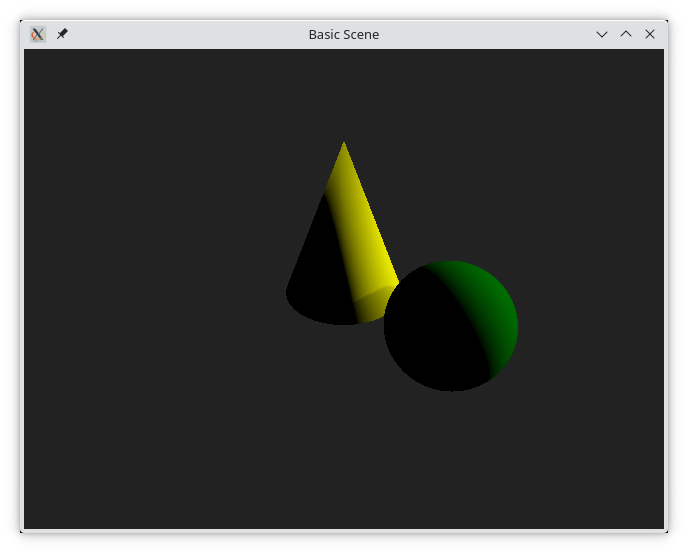
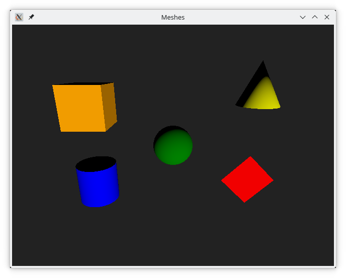

# The Basics

In this section we will walk through the basics of Qt Quick 3D. This includes working with the built in shapes (meshes), using lights, and transformations in 3D.

## A Basic Scene

A 3D scene consists of a few standard elements:

* `View3D`, which is the top level QML element representing the entire 3D scene.
* `SceneEnvironment`, controls how the scene is rendered, including how the background, or sky box, is rendered.
* `PerspectiveCamera`, the camera in the scene. Can also be a `OrthographicCamera`, or even a custom camera with a custom projection matrix.

In addition to this, the scene usually contains `Model` instances representing objects in the 3D space, and lights.

We will look at how these elements interact by creating the scene shown below.



First of all, the QML code is setup with a `View3D` as the main element, filling the window. We also import the `QtQuick3D` module.

The `View3D` element can be seen as any other Qt Quick element, just that inside of it, the 3D contents will be rendered.

```qml
import QtQuick
import QtQuick3D

Window {
    width: 640
    height: 480
    visible: true
    title: qsTr("Basic Scene")

    View3D {
        anchors.fill: parent

        // ...
    
    }
}
```

Then we setup the `SceneEnvironment` with a solid background colour. This is done inside the `View3D` element.

```
environment: SceneEnvironment {
    clearColor: "#222222"
    backgroundMode: SceneEnvironment.Color
}
```

The `SceneEnvironment` can be used to control a lot more rendering parameters, but for now, we only use it to set a solid background colour.

The next step is to add _meshes_ to the scene. A mesh represents an object in 3D space. Each mesh is created using a `Model` QML element.

A model can be used to load 3D assets, but there are a few built-in meshes allowing us to get started without involving the complexity of 3D assets management. In the code below, we create a `#Cone` and a `#Sphere`.

In addition to the shape of the mesh, we position them in 3D space and provide them with a material with a simple, diffuse base colour. We will discuss materials more in the \[Materials and Light]\("Materials and Lights") section

When positioning elements in 3D space, coordinates are expressed as `Qt.vector3d(x, y, z)` where the `x` axis controls the horizontal movement, `y` is the vertical movement, and `z` the how close or far away something is.

By default, the positive direction of the `x` axis is to the right, positive `y` points upwards, and positive `z` out of the screen. I say default, because this depends on the projection matrix of the camera.

```
Model {
    position: Qt.vector3d(0, 0, 0)
    scale: Qt.vector3d(1, 1.25, 1)
    source: "#Cone"
    materials: [ PrincipledMaterial { baseColor: "yellow"; } ]
}

Model {
    position: Qt.vector3d(80, 0, 50)
    source: "#Sphere"
    materials: [ PrincipledMaterial { baseColor: "green"; } ]
}
```

Once we have lights in the scene we add a `DirectionalLight`, which is a light that works much like the sun. It adds an even light in a pre-determined direction. The direction is controlled using the `eulerRotation` property where we can rotate the light direction around the various axes.

By setting the `castsShadow` property to `true` we ensure that the light generates shadows as can be seen on cone, where the shadow from the sphere is visible.

```
DirectionalLight {
    eulerRotation.x: -20
    eulerRotation.y: 110

    castsShadow: true
}
```

The last piece of the puzzle is to add a camera to the scene. There are various cameras for various perspectives, but for a realistic projection, the `ProjectionCamera` is the one to use.

In the code, we place the camera using the `position` property. It is then possible to direct the camera using the `eulerRotation` property, but instead we call the `lookAt` method from the `Component.onCompleted` signal handler. This rotates the camera to look at a specific direction once it has been created and initialized.

```
PerspectiveCamera {
    position: Qt.vector3d(0, 200, 300)
    Component.onCompleted: lookAt(Qt.vector3d(0, 0, 0))
}
```

The resulting scene can be seen below.


So, all in all, a minimal scene consists of a `View3D` with an `SceneEnvironment`, something to look at, e.g. a `Model` with a mesh, a light source, e.g. a `DirectionalLight`, and something to look with, e.g. a `PerspectiveCamera`.

## The Built-in Meshes

In the previous example, we used the built-in cone and sphere. Qt Quick 3D comes with the following built in meshes:

* `#Cube`
* `#Cone`
* `#Sphere`
* `#Cylinder`
* `#Rectangle`

These are all shown in the illustration below. (top-left: Cube, top-right: Cone, center: Sphere, bottom-left: Cylinder, bottom-right: Rectangle)



 Tip One caveat is that the `#Rectangle` is one-sided. That means that it is only visible from one direction. This means that the `eulerRotation` property is important. 

When working with real scenes, the meshes are exported from a design tool and then imported into the Qt Quick 3D scene. We look at this in more detail in the [Working with Assets](assets.md) section.

## Lights

Just as with meshes, Qt Quick 3D comes with a number of pre-defined light sources. These are used to light the scene in different ways.

The first one, `DirectionalLight`, should be familiar from our previous example. It works much as the sun, and casts light uniformly over the scene in a given direction. If the `castsShadow` property is set to `true`, the light will cast shadows, as shown in the illustration below. This property is available for all the light sources.


```
DirectionalLight {
    eulerRotation.x: 210
    eulerRotation.y: 20

    castsShadow: true
}
```

The next light source is the `PointLight`. It is a light that eminates from a given point in space and then falls off towards darkness based on the values of the `constantFade`, `linearFade`, and `quadraticFace` properties, where the light is calculated as `constantFade + distance * (linearFade * 0.01) + distance^2 * (quadraticFade * 0.0001)`. The default values are `1.0` constant and quadratic fade, and `0.0` for the linear fade, meaning that the light falls off according to the inverse square law.


```
PointLight {
    position: Qt.vector3d(100, 100, 150)

    castsShadow: true
}
```

The last of the light sources is the `SpotLight` which emits a cone of light in a given direction, much like a real world spotlight. The cone consists of an inner and an outer cone. The width of these is controlled by the `innerConeAngle` and `coneAngle`, specified in degrees between zero and 180 degrees.

The light in the inner cone behaves much like a `PointLight` and can be controlled using the `constantFade`, `linearFade`, and `quadraticFace` properties. In addition to this, the light fades towards darkness as it approaches the outer cone, controlled by the `coneAngle`.


```
SpotLight {
    position: Qt.vector3d(50, 200, 50)
    eulerRotation.x: -90

    brightness: 5
    ambientColor: Qt.rgba(0.1, 0.1, 0.1, 1.0)

    castsShadow: true
}
```

In addition to the `castsShadow` property, all lights also has the commonly used properties `color` and `brightness` which control the color and intensity of the light emitted. The lights also has an `ambientColor` property defining a base color to be applied to materials, before they are lit by the light source. This property is set to black by default, but can be used to provide a base lighting in a scene.

In the examples this far, we've only used one light source at a time, but it is of course possible to combine multiple light sources in a single scene.
