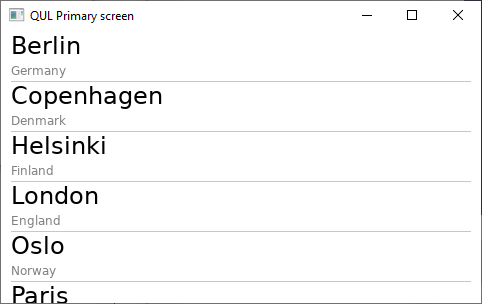
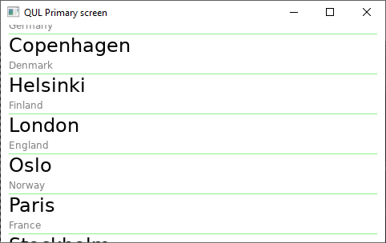
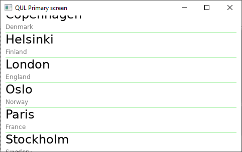

# Working with Models

In Qt Quick Ultralite, it is possible to create models in QML using the `ListModel` element. It is also possible, and a bit more interesting, to create models from C++. This lets you expose lists of data from C++ to QML and to instantiate user interface elements for each item of the list. The setup is very similar to the ordinary Qt Quick, but the base classes and interfaces are more limited.

In this chapter we will create a list of cities in Europe, listing the name of the city and the country in which the city is located. The cities will be shown in a `ListView` as shown below:



## The C++

To create a model in Qt Quick Ultralite, the first thing we need to do is to define a `struct` with the data of each list item. For this struct, we also need to provide a `==` operator. This is what we do with the `CityData` struct shown below. Notice that we use `std::string` rather than `QString` in Qt Quick Ultralite. The assumption is that UTF-8 encoding is used.

```
#include <string>

struct CityData
{
    std::string name;
    std::string country;
};

inline bool operator==(const CityData &l, const CityData &r)
{
    return l.name == r.name && l.country == r.country;
}
```

Once the data type has been prepared, we declare the `CityModel` struct, inheriting from `Qul::ListModel`. This lets us define a model that can be accessed from QML. We must implement the `count` and `data` methods, which are similar, but not identical to, the corresponding methods from the `QAbstractListModel` class. We also use the \`CMake macro `qul_target_generate_interfaces` to make the types available to QML.

```
#include <qul/model.h>
#include <platforminterface/allocator.h>

struct CityModel : Qul::ListModel<CityData>
{
private:
    Qul::PlatformInterface::Vector<CityData> m_data;

public:
    CityModel();

    int count() const override { return m_data.size(); }
    CityData data(int index) const override { return m_data[index]; }
};
```

We also implement a constructor for the `CityModel` struct that populates the `m_data` vector with data.

```
#include "citymodel.h"

CityModel::CityModel()
{
    m_data.push_back(CityData {"Berlin", "Germany"});
    m_data.push_back(CityData {"Copenhagen", "Denmark"});
    m_data.push_back(CityData {"Helsinki", "Finland"});
    m_data.push_back(CityData {"London", "England"});
    m_data.push_back(CityData {"Oslo", "Norway"});
    m_data.push_back(CityData {"Paris", "France"});
    m_data.push_back(CityData {"Stockholm", "Sweden"});
}
```

## The QML

In the example, we show the model as a scrollable list, as shown below.



The QML code is shown in its entirety below:

```
import QtQuick 2.0

Rectangle {
    width: 480
    height: 272

    CityModel {
        id: cityModel
    }

    Component {
        id: cityDelegate

        Item {
            width: 480
            height: 45

            Column {
                spacing: 2
                Text {
                    text: model.name
                    x: 10
                    font: Qt.font({
                            pixelSize: 24,
                            unicodeCoverage: [Font.UnicodeBlock_BasicLatin]
                        })
                }
                Text {
                    text: model.country
                    x: 10
                    color: "gray"
                    font: Qt.font({
                            pixelSize: 12,
                            unicodeCoverage: [Font.UnicodeBlock_BasicLatin]
                        })
                }
                Rectangle {
                    color: "lightGreen"
                    x: 10
                    width: 460
                    height: 1
                }
            }
        }
    }

    ListView {
        anchors.fill: parent
        model: cityModel
        delegate: cityDelegate
        spacing: 5
    }
}
```

The example starts by instantiating the `cityModel`. As the model is not a singleton, it has to be instantiated from QML.

Then the delegate, `cityDelegate` is implemented as a `Component`. This means that it can be instantiated multiple times from QML. The model data is accessed via the `model.name` and `model.country` attached properties.

Finally, the `ListView` element joins the model and the delegate, resulting in the list shown in the screenshots in this chapter.



An interesting aspect of the QML is how the font of the `Text` elements is configured. The `unicodeCoverage` property lets us tell the Qt Quick Ultralite compiler what characters we would like to be able to render. When specifying fixed strings, the Qt Quick Ultralite tooling generates minimal fonts containing exactly the glyphs that we intend to use. However, since the model will provide us with dynamic data, we need to tell the font what characters we expect to use.

When rendering a complete font, sometimes you encounter the following style of warnings:

```
[2/7 8.8/sec] Generating CMakeFiles/cppmodel.dir/qul_font_engines.cpp, CMakeFiles/cppmodel.dir/qul_font_data.cpp
Warning: Glyph not found for character "\u0000"
Warning: Glyph not found for character "\u0001"
Warning: Glyph not found for character "\u0002"
Warning: Glyph not found for character "\u0003"
Warning: Glyph not found for character "\u0004"
Warning: Glyph not found for character "\u0005"
Warning: Glyph not found for character "\u0006"
Warning: Glyph not found for character "\u0007"
...
```

These can safely be disregarded, unless you expect to show the character in question.
